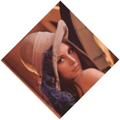
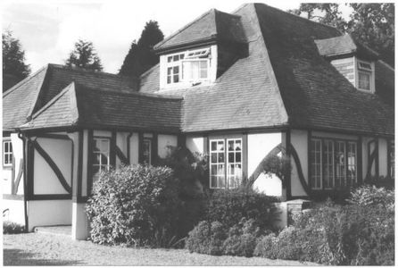
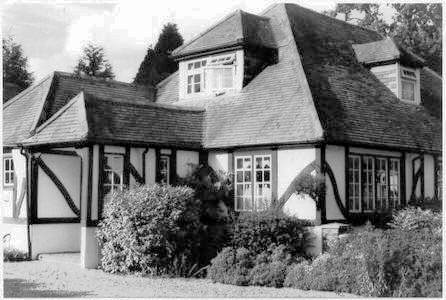
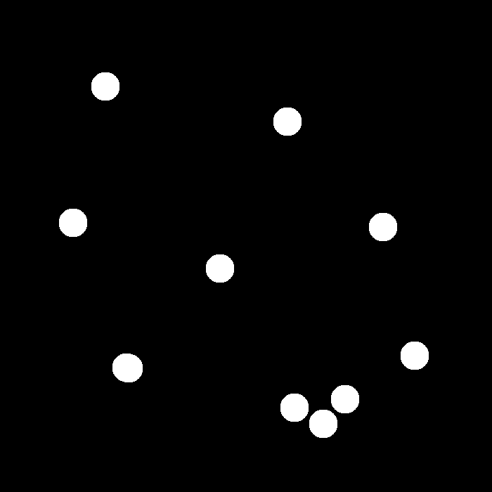
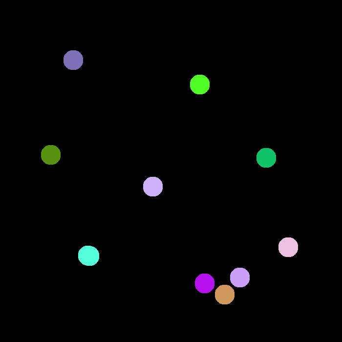
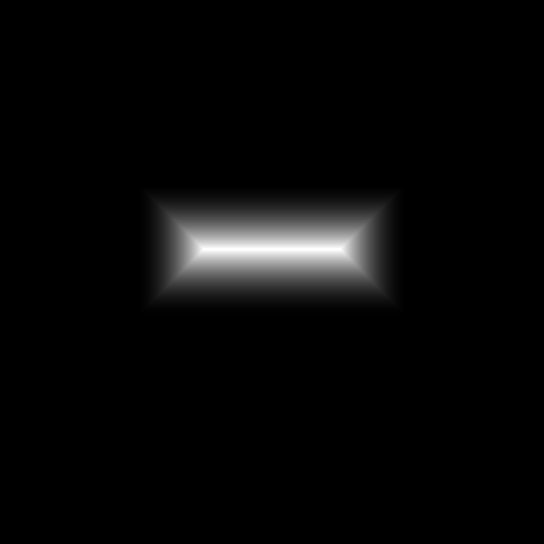

# Imago

Imago is an image manipulation library for Common Lisp. It supports images in
png, pcx, portable bitmap (.pnm), Truevision TGA (.tga) and jpeg formats. You
can read an image with `imago:read-image` and write an image with
`imago:write-format` where `format` is one of `png`, `pcx`, `pnm`, `tga` or
`jpg`.

## Reading from and writing to jpeg files with libjpeg-turbo

You can use more advanced [libjpeg-turbo](https://libjpeg-turbo.org/) library to
deal with jpeg files by loading `imago/jpeg-turbo` system. Make sure that
`libjpeg-turbo` is installed on your system. Use
`imago-jpeg-turbo:read-jpg-turbo` and `imago-jpeg-turbo:write-jpg-turbo`
functions (or just `imago:read-image` and `imago:write-image`) to use this
functionality.

## Reading images with pngload

You can use more advanced and faster
[pngload](https://github.com/bufferswap/pngload) library to read png files by
loading `imago/pngload` system. Use `imago-pngload:read-pngload` (or just
`imago:read-image`) to use this functionality. **NB:** `pngload` automatically
converts indexed color images to RGB (or ARGB) images. If you want to work with
indexed images, use old png loader instead.

## Usage examples

Most of the examples are taken from
[here](http://matthieu.villeneuve.free.fr/dev/imago/examples.html).

### Resizing an image

`(resize *image* 400 150)`

| Original | Processed |
| -------- | --------- |
|  |  |

### Rotating an image

`(rotate *image* 45)`

| Original | Processed |
| -------- | --------- |
|  |  |

### Applying an emboss effect

`(emboss *image* :angle (* pi 0.75) :depth 1.0)`

| Original | Processed |
| -------- | --------- |
|  |  |

### Using a custom convolution kernel

~~~~{.lisp}
(let ((kernel #2A((0  0  0  0  0)
                  (0  0  1  0  0)
                  (0  1 -4  1  0)
                  (0  0  1  0  0)
                  (0  0  0  0  0))))
  (convolve *image* kernel 1 0))
~~~~

| Original | Processed |
| -------- | --------- |
|  |  |

### Inverting a rectangular region

~~~~
(do-region-pixels (*image* color x y 70 65 140 125)
  (setf color (invert-color color)))
~~~~

| Original | Processed |
| -------- | --------- |
|  |  |

### Adjusting contrast of a grayscale image

~~~~
(enhance-contrast *grayscale-image*)
~~~~

| Original | Processed |
| -------- | --------- |
|  |  |

### Manipulating color components

~~~~{.lisp}
(do-image-pixels (*image* color x y)
  (multiple-value-bind (r g b) (color-rgb color)
    (setf color (make-color b
                            (floor (* g 0.8))
                            r))))
~~~~

| Original | Processed |
| -------- | --------- |
|  |  |

### Composing pictures

~~~~{.lisp}
(let ((operator (default-compose-operator *image1*)))
  (compose nil *image1* *image2* 20 20 operator))
~~~~

| Original 1 | Original 2 | Processed |
| ---------- | ---------- | --------- |
|  |  |  |

### Drawing simple primitives

~~~~{.lisp}
(let ((points '(83 45 73 150 73 150 198 106 198 106 83 45)))
  (draw-polygon *image* points +white+ :closed t))
(draw-circle *image* 83 45 15 +white+)
(draw-circle *image* 73 150 15 +white+)
(draw-circle *image* 198 106 15 +white+)
(draw-bezier-curve *image* 10 80 150 60 100 170 200 170 +red+)
(draw-line *image* 0 5 254 5 +yellow+)
(draw-line *image* 0 10 254 10 +yellow+ :dash-length 1 :dash-interval 1)
(draw-line *image* 0 15 254 15 +yellow+ :dash-length 4 :dash-interval 2)
~~~~

| Original | Processed |
| -------- | --------- |
|  |  |

### A more complex example

~~~~{.lisp}
(defun sea-view (image)
  (let ((image2 (flip nil image :horizontal)))
    (do-image-pixels (image2 color x y)
      (multiple-value-bind (r g b)
          (color-rgb color)
        (setf color (make-color (floor r 3) (floor g 3) (floor b 2)))))
    (let* ((width (image-width image))
           (height (image-height image))
           (result (make-instance (class-of image)
                                  :width width :height (* height 2))))
      (copy result image)
      (copy result image2 :dest-y height)
      result)))
~~~~

| Original | Processed |
| -------- | --------- |
|  |  |

### Connected components labeling

This example requires snakes and array-operations systems (available in
quicklisp).

~~~~{.lisp}
(defpackage components-example
  (:use #:cl
        #:snakes
        #:imago)
  (:export #:convert-to-image))
(in-package :components-example)

(defgenerator generate-colors ()
  (loop while t do
    (yield (make-color (random 256)
                       (random 256)
                       (random 256)))))

(defgenerator black ()
  (yield (make-color 0 0 0)))

(defun convert-to-image (components)
  (declare (type (simple-array fixnum (* *)) components))
  (let ((colors (take (1+ (reduce #'max (aops:flatten components)))
                      (chain (black)
                             (generate-colors))))
        (image (make-array (array-dimensions components)
                           :element-type 'rgb-pixel)))
    (array-operations/utilities:nested-loop (i j)
        (array-dimensions components)
      (setf (aref image i j)
            (nth (aref components i j) colors)))
    (make-instance 'rgb-image :pixels image)))

(in-package :cl-user)
(let* ((image (imago:read-image "~/.quicklisp/local-projects/imago/tests/spheres.png"))
       (components (imago:label-components (imago:convert-to-binary image 1))))
  (components-example:convert-to-image components))
~~~~

| Original | Processed |
| -------- | --------- |
|  |  |

### Distance transform

Calculating squared Euclidean distance transform (also Manhattan distance
transform is available). This example requires `array-operations`.

~~~~{.lisp}
(defun edt-image (image)
  (declare (type imago:binary-image image))
  (let* ((dt (imago:distance-transform image :type :edt))
         (max (reduce #'max (aops:flatten dt)))
         (pixels (make-array (array-dimensions dt) :element-type 'imago:grayscale-pixel)))
    (map-into (aops:flatten pixels)
              (lambda (x) (imago:make-gray (floor (* 255 x) max)))
              (aops:flatten dt))
    (make-instance 'imago:grayscale-image :pixels pixels)))

(edt-image original-image)
~~~~

| Original | Processed |
| -------- | --------- |
|  |  |
